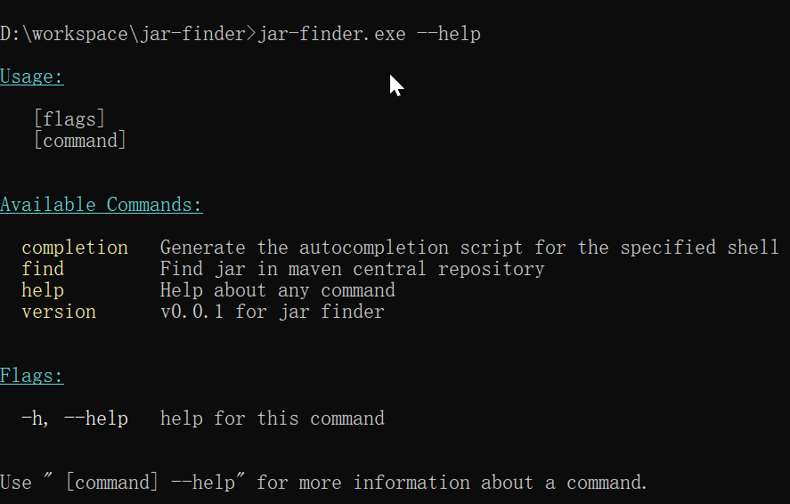
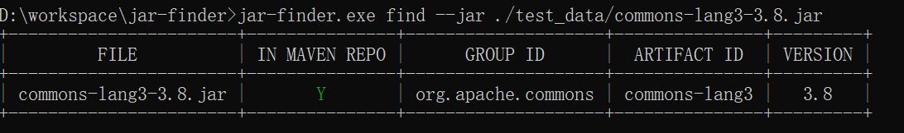
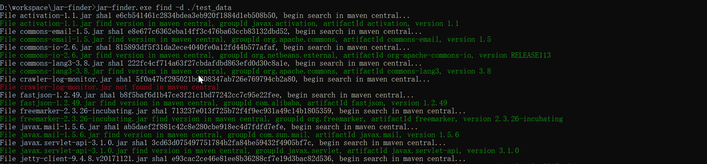
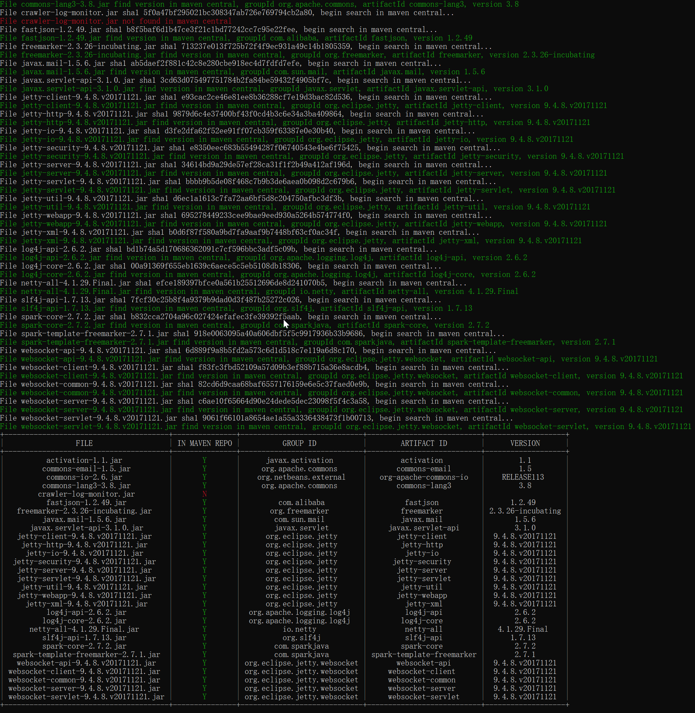

# Jar Finder

# 一、这是什么？解决了什么问题？

- 用于把`Jar`包转换为`Maven`的`GAV`坐标来精简项目依赖

比如是通过逆向的方式分析出一个闭源的`Java`应用发行版的`API`来使用，一般这种情况下依赖的`Jar`包会分为两类，其中一类是此应用本身的依赖包，比如这个应用它依赖到了`Apache`的一些包，通常会以一堆`Jar`包的形式放在应用安装目录下一个名为`lib`的文件夹内，这个时候我们可以选择把这个`lib`文件夹囫囵个儿拷贝到我们自己的项目中然后把整个`lib`文件夹添加到依赖，虽然也能够跑起来，但是这有一些弊端，为了避免依赖丢失，这些`Jar`包我们得提交到仓库，通常情况下会有几百兆甚至上`G`，这要了老命了，或者更好的方式是既然我们知道这些`Jar`包都在`Maven`中央仓库中存在，那么我们直接把他们加入到`pom.xml`中即可，让`Maven`构建的时候从中央仓库中下载，但是问题来了，我们如何快速的将这些jar包转为`Maven`的`dependency`呢？这个工具就是干这个用的。

- 找出一堆`Jar`包中哪些是在`Maven`中央仓库上的，哪些是在自定义的包

比如我们要逆向分析一个`Java`应用，找到了与这个`Java`应用相关的一堆`Jar`包，但是这些`Jar`包中哪些是有分析价值的呢？公共的依赖包对于逆向分析的帮助不大（我们看了半天才发现是一个公共包岂不是日了狗），应用自己的`Jar`包对我们的帮助会比较大，而通常情况下应用自己的`Jar`包是不会托管到`Maven`仓库中的（当然也有一些例外），我们可以借助此工具大致把有分析价值的包区分出来。

# 二、下载安装

release页面下载或者自己go get仓库编译

# 三、使用示例



查找给定的jar包在Maven仓库中的GAV：

```bash
jar-finder.exe find --jar ./test_data/commons-lang3-3.8.jar
```

结果：




查找给定文件夹下的jar包在仓库中的GAV： 

```bash
jar-finder.exe find -d ./test_data
```





在查询的时候并将结果输出为pom.xml的形式： 

```bash
jar-finder.exe find -d ./test_data --pom pom.xml
```

`pom.xml`的数据样例：

```xml
<?xml version="1.0" encoding="UTF-8"?>
<project xmlns="http://maven.apache.org/POM/4.0.0"
         xmlns:xsi="http://www.w3.org/2001/XMLSchema-instance"
         xsi:schemaLocation="http://maven.apache.org/POM/4.0.0 http://maven.apache.org/xsd/maven-4.0.0.xsd">
    <modelVersion>4.0.0</modelVersion>


    <dependencies>

        <!-- https://mvnrepository.com/artifact/javax.activation/activation/1.1 -->
        <dependency>
            <groupId>javax.activation</groupId>
            <artifactId>activation</artifactId>
            <version>1.1</version>
        </dependency>

        <!-- https://mvnrepository.com/artifact/org.apache.commons/commons-email/1.5 -->
        <dependency>
            <groupId>org.apache.commons</groupId>
            <artifactId>commons-email</artifactId>
            <version>1.5</version>
        </dependency>

        <!-- https://mvnrepository.com/artifact/org.netbeans.external/org-apache-commons-io/RELEASE113 -->
        <dependency>
            <groupId>org.netbeans.external</groupId>
            <artifactId>org-apache-commons-io</artifactId>
            <version>RELEASE113</version>
        </dependency>

        <!-- https://mvnrepository.com/artifact/org.apache.commons/commons-lang3/3.8 -->
        <dependency>
            <groupId>org.apache.commons</groupId>
            <artifactId>commons-lang3</artifactId>
            <version>3.8</version>
        </dependency>

        <!-- https://mvnrepository.com/artifact/com.alibaba/fastjson/1.2.49 -->
        <dependency>
            <groupId>com.alibaba</groupId>
            <artifactId>fastjson</artifactId>
            <version>1.2.49</version>
        </dependency>

        <!-- https://mvnrepository.com/artifact/org.freemarker/freemarker/2.3.26-incubating -->
        <dependency>
            <groupId>org.freemarker</groupId>
            <artifactId>freemarker</artifactId>
            <version>2.3.26-incubating</version>
        </dependency>

        <!-- https://mvnrepository.com/artifact/com.sun.mail/javax.mail/1.5.6 -->
        <dependency>
            <groupId>com.sun.mail</groupId>
            <artifactId>javax.mail</artifactId>
            <version>1.5.6</version>
        </dependency>

        <!-- https://mvnrepository.com/artifact/javax.servlet/javax.servlet-api/3.1.0 -->
        <dependency>
            <groupId>javax.servlet</groupId>
            <artifactId>javax.servlet-api</artifactId>
            <version>3.1.0</version>
        </dependency>

        <!-- https://mvnrepository.com/artifact/org.eclipse.jetty/jetty-client/9.4.8.v20171121 -->
        <dependency>
            <groupId>org.eclipse.jetty</groupId>
            <artifactId>jetty-client</artifactId>
            <version>9.4.8.v20171121</version>
        </dependency>

        <!-- https://mvnrepository.com/artifact/org.eclipse.jetty/jetty-http/9.4.8.v20171121 -->
        <dependency>
            <groupId>org.eclipse.jetty</groupId>
            <artifactId>jetty-http</artifactId>
            <version>9.4.8.v20171121</version>
        </dependency>

        <!-- https://mvnrepository.com/artifact/org.eclipse.jetty/jetty-io/9.4.8.v20171121 -->
        <dependency>
            <groupId>org.eclipse.jetty</groupId>
            <artifactId>jetty-io</artifactId>
            <version>9.4.8.v20171121</version>
        </dependency>

        <!-- https://mvnrepository.com/artifact/org.eclipse.jetty/jetty-security/9.4.8.v20171121 -->
        <dependency>
            <groupId>org.eclipse.jetty</groupId>
            <artifactId>jetty-security</artifactId>
            <version>9.4.8.v20171121</version>
        </dependency>

        <!-- https://mvnrepository.com/artifact/org.eclipse.jetty/jetty-server/9.4.8.v20171121 -->
        <dependency>
            <groupId>org.eclipse.jetty</groupId>
            <artifactId>jetty-server</artifactId>
            <version>9.4.8.v20171121</version>
        </dependency>

        <!-- https://mvnrepository.com/artifact/org.eclipse.jetty/jetty-servlet/9.4.8.v20171121 -->
        <dependency>
            <groupId>org.eclipse.jetty</groupId>
            <artifactId>jetty-servlet</artifactId>
            <version>9.4.8.v20171121</version>
        </dependency>

        <!-- https://mvnrepository.com/artifact/org.eclipse.jetty/jetty-util/9.4.8.v20171121 -->
        <dependency>
            <groupId>org.eclipse.jetty</groupId>
            <artifactId>jetty-util</artifactId>
            <version>9.4.8.v20171121</version>
        </dependency>

        <!-- https://mvnrepository.com/artifact/org.eclipse.jetty/jetty-webapp/9.4.8.v20171121 -->
        <dependency>
            <groupId>org.eclipse.jetty</groupId>
            <artifactId>jetty-webapp</artifactId>
            <version>9.4.8.v20171121</version>
        </dependency>

        <!-- https://mvnrepository.com/artifact/org.eclipse.jetty/jetty-xml/9.4.8.v20171121 -->
        <dependency>
            <groupId>org.eclipse.jetty</groupId>
            <artifactId>jetty-xml</artifactId>
            <version>9.4.8.v20171121</version>
        </dependency>

        <!-- https://mvnrepository.com/artifact/org.apache.logging.log4j/log4j-api/2.6.2 -->
        <dependency>
            <groupId>org.apache.logging.log4j</groupId>
            <artifactId>log4j-api</artifactId>
            <version>2.6.2</version>
        </dependency>

        <!-- https://mvnrepository.com/artifact/org.apache.logging.log4j/log4j-core/2.6.2 -->
        <dependency>
            <groupId>org.apache.logging.log4j</groupId>
            <artifactId>log4j-core</artifactId>
            <version>2.6.2</version>
        </dependency>

        <!-- https://mvnrepository.com/artifact/io.netty/netty-all/4.1.29.Final -->
        <dependency>
            <groupId>io.netty</groupId>
            <artifactId>netty-all</artifactId>
            <version>4.1.29.Final</version>
        </dependency>

        <!-- https://mvnrepository.com/artifact/org.slf4j/slf4j-api/1.7.13 -->
        <dependency>
            <groupId>org.slf4j</groupId>
            <artifactId>slf4j-api</artifactId>
            <version>1.7.13</version>
        </dependency>

        <!-- https://mvnrepository.com/artifact/com.sparkjava/spark-core/2.7.2 -->
        <dependency>
            <groupId>com.sparkjava</groupId>
            <artifactId>spark-core</artifactId>
            <version>2.7.2</version>
        </dependency>

        <!-- https://mvnrepository.com/artifact/com.sparkjava/spark-template-freemarker/2.7.1 -->
        <dependency>
            <groupId>com.sparkjava</groupId>
            <artifactId>spark-template-freemarker</artifactId>
            <version>2.7.1</version>
        </dependency>

        <!-- https://mvnrepository.com/artifact/org.eclipse.jetty.websocket/websocket-api/9.4.8.v20171121 -->
        <dependency>
            <groupId>org.eclipse.jetty.websocket</groupId>
            <artifactId>websocket-api</artifactId>
            <version>9.4.8.v20171121</version>
        </dependency>

        <!-- https://mvnrepository.com/artifact/org.eclipse.jetty.websocket/websocket-client/9.4.8.v20171121 -->
        <dependency>
            <groupId>org.eclipse.jetty.websocket</groupId>
            <artifactId>websocket-client</artifactId>
            <version>9.4.8.v20171121</version>
        </dependency>

        <!-- https://mvnrepository.com/artifact/org.eclipse.jetty.websocket/websocket-common/9.4.8.v20171121 -->
        <dependency>
            <groupId>org.eclipse.jetty.websocket</groupId>
            <artifactId>websocket-common</artifactId>
            <version>9.4.8.v20171121</version>
        </dependency>

        <!-- https://mvnrepository.com/artifact/org.eclipse.jetty.websocket/websocket-server/9.4.8.v20171121 -->
        <dependency>
            <groupId>org.eclipse.jetty.websocket</groupId>
            <artifactId>websocket-server</artifactId>
            <version>9.4.8.v20171121</version>
        </dependency>

        <!-- https://mvnrepository.com/artifact/org.eclipse.jetty.websocket/websocket-servlet/9.4.8.v20171121 -->
        <dependency>
            <groupId>org.eclipse.jetty.websocket</groupId>
            <artifactId>websocket-servlet</artifactId>
            <version>9.4.8.v20171121</version>
        </dependency>


        <-- Below are local dependencies -->


        <dependency>
            <groupId>test_data\crawler-log-monitor.jar</groupId>
            <artifactId>test_data\crawler-log-monitor.jar</artifactId>
            <version>test_data\crawler-log-monitor.jar</version>
            <scope>system</scope>
            <systemPath>test_data\crawler-log-monitor.jar</systemPath>
        </dependency>

    </dependencies>


</project>
```


